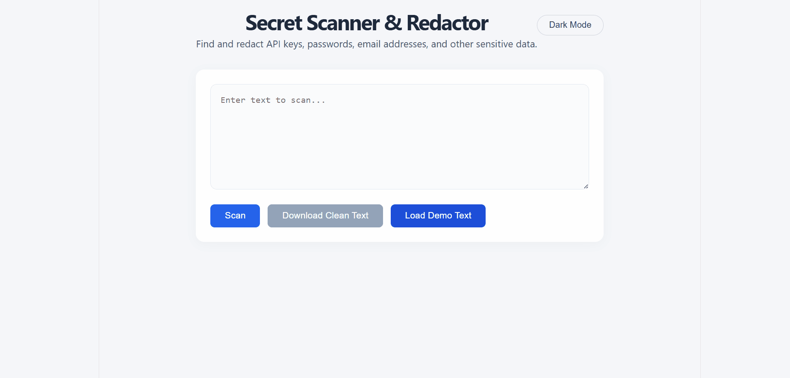

# Secret Scanner & Redactor

Alat za automatsku detekciju i redakciju osetljivih podataka (API kljucevi, lozinke, e-mail adrese, JWT tokeni itd.) u tekstu i dokumentima.

## Funkcionalnosti
- Regex skeniranje za 10+ tipova tajni (AWS kljucevi, GitHub tokeni, e-mail, kreditne kartice...)
- Entropijska analiza za pronalazenje nasumicnih stringova (potencijalne tajne)
- Prikaz originalnog teksta sa maskiranim osetljivim podacima ([REDACTED])
- Tabelarni pregled svih pronadjenih stavki sa tipom i pozicijom
- Preuzimanje ociscenog teksta kao .txt fajla
- Tamni/svetli rezim (podesavanje se cuva lokalno)
- Demo tekst za brzi prikaz rada alata
- Spremno za AI: Hugging Face NER model za prepoznavanje licnih podataka (trenutno iskljucen)

## Tehnologije
- **Backend:** Python, FastAPI, Uvicorn
- **Frontend:** React (Vite)
- **Dodatno:** Hugging Face Inference API, python-dotenv, requests

## Pokretanje lokalno
1. Kloniraj repozitorijum:
   ```bash
   git clone https://github.com/Maksitor/secret-scanner-redactor.git
   cd secret-scanner-redactor

## Demo
